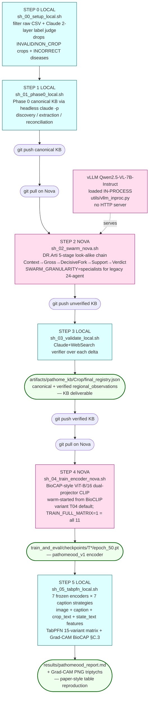
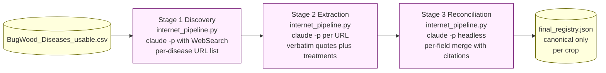
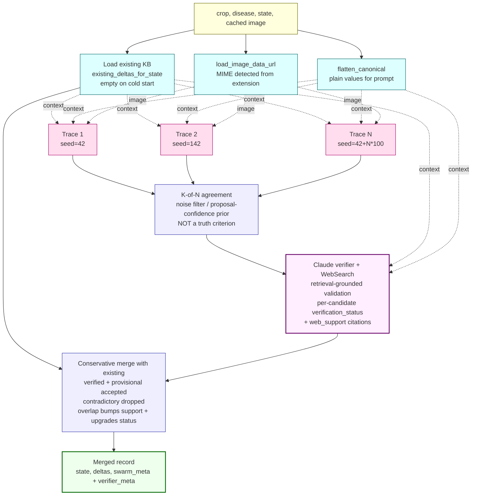
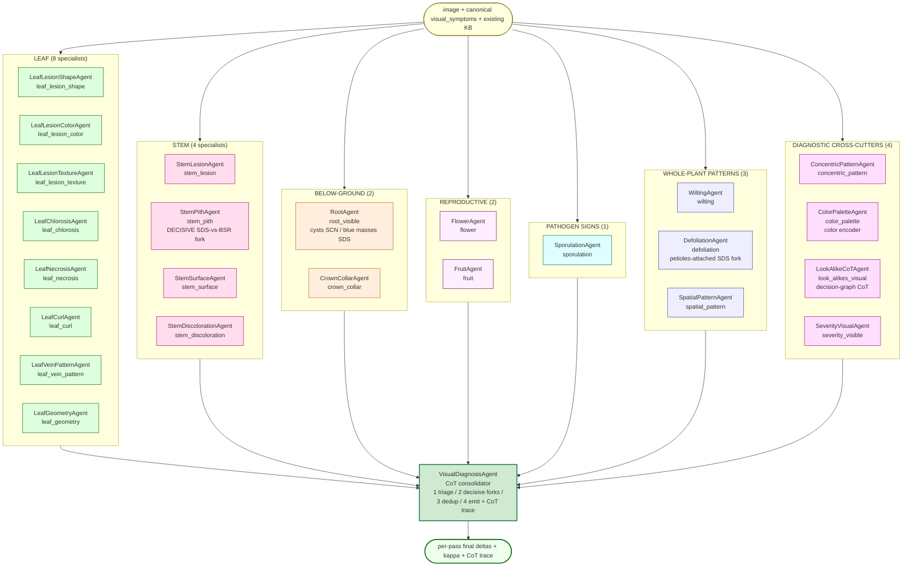
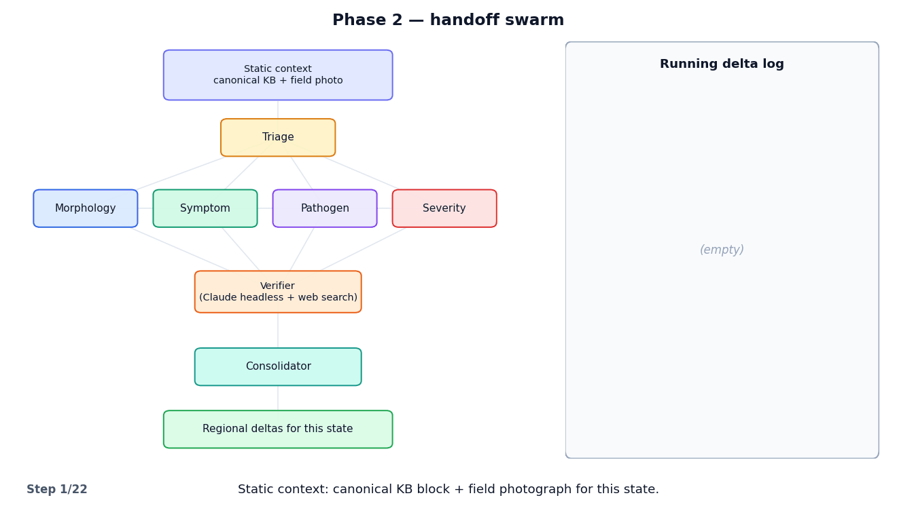
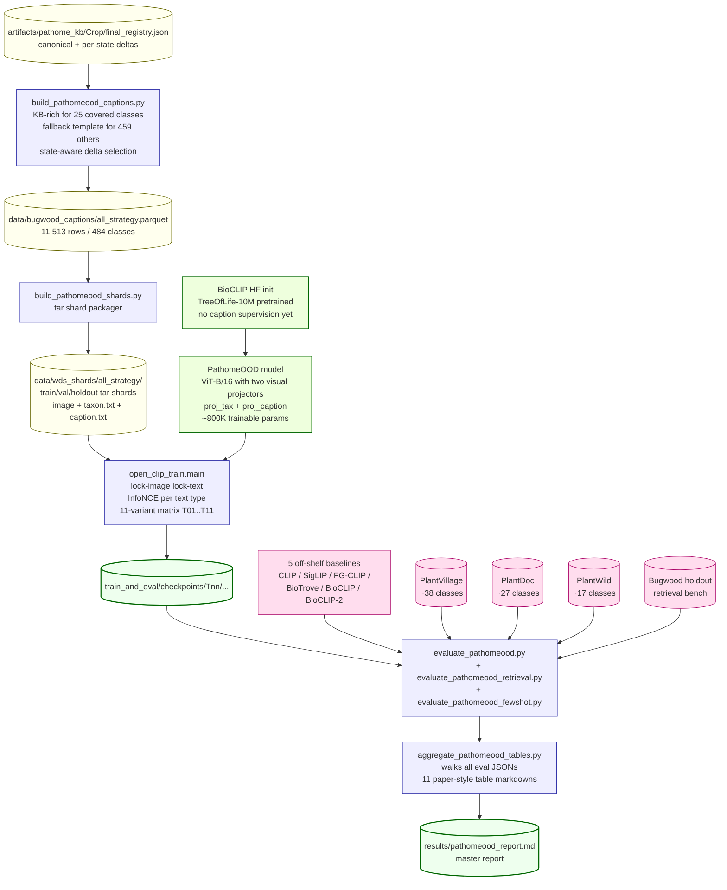

# PlantSwarm — End-to-End Flow

Submission-ready overview of the current pipeline. All flowcharts are
Mermaid (renderable on GitHub, mermaid.live, and any standard Markdown
viewer); data shapes are ASCII for stable layout.

Sections
1. [Top-level pipeline](#1-top-level-pipeline)
2. [Phase 0 — canonical KB (Claude)](#2-phase-0--canonical-kb-claude)
3. [Phase 0R — regional deltas (Qwen visual-symptom swarm)](#3-phase-0r--regional-deltas-qwen-swarm)
   - 3a. [Per-tuple flow (iterative KB loop)](#3a-per-tuple-flow-iterative-kb-loop)
   - 3b. [Inside one pass (24 visual specialists + CoT consolidator)](#3b-inside-one-pass-24-visual-specialists--cot-consolidator)
   - 3c. [Animated walkthrough](#3c-animated-walkthrough)
   - 3d. [Cross-pass K-of-N agreement filter](#3d-cross-run-k-of-n-agreement-filter)
   - 3e. [Conservative merge with existing KB](#3e-conservative-merge-with-existing-kb)
4. [Phase PathomeOOD — KB-grounded CLIP training](#4-phase-pathomeood--kb-grounded-clip-training)
5. [Data shape evolution](#5-data-shape-evolution)
6. [File map](#6-file-map)
7. [Env var reference](#7-env-var-reference)
8. [Run-report line](#8-run-report-line)

---

## 1. Top-level pipeline

LOCAL machine ⇄ GitHub ⇄ NOVA. One shell script per step, six steps
in total, hand-off via `git push` / `git pull`.



> **vLLM is in-process.** Phase 0R does not run `vllm serve`. The swarm
> imports `vllm.LLM` directly via `utils/vllm_inproc.py` and the engine
> lives in the same Python process that runs the agents. There is no
> HTTP boundary, no port, and no separate server process to wait on or
> tear down. This replaces the earlier `vllm serve` + OpenAI-compatible
> HTTP client architecture, which produced silent `HTTPError: 400`
> failures that zeroed out every tuple of an earlier Nova run.

| # | Step | Host | Compute | Walltime |
|---|---|---|---|---|
| 0 | Filter CSV + Claude label judge | LOCAL | Claude (headless) | smoke ~10-30 min / prod ~1-2 h |
| 1 | Phase 0 canonical KB | LOCAL | Claude (headless) | smoke ~30-45 min / prod 16-24 h |
| 2 | DR.Arti 5-stage Qwen chain (in-process vLLM) | NOVA | 1× A100-80GB | smoke ~0.5-1 h / prod ~3-6 h (5 calls/pass; ≈49 in legacy specialists mode) |
| 3 | Claude+WebSearch verifier | LOCAL | Claude (headless) | smoke ~30-60 min / prod 1-3 days |
| 4 | BioCAP-style encoder fine-tune | NOVA | 1× A100 | ~30-60 min per variant; ~5 GPU-h for T01..T11 |
| 5 | Frozen-encoder + TabPFN + Grad-CAM | LOCAL | 1× small GPU + CPU | smoke ~1-2 h / prod ~4-8 h |

---

## 2. Phase 0 — canonical KB (Claude)

Run via `python -m pathome_kb`. Three Claude-driven stages per crop, all
text-grounded (URL + verbatim quote per field). No images touched here.



Output shape (one disease entry):

```jsonc
{
  "disease_name": "Charcoal Rot",
  "pathogen_scientific_name": {
    "value": "Macrophomina phaseolina",
    "url":   "https://extension.umn.edu/.../charcoal-rot-soybean",
    "quote": "Charcoal rot is caused by the soilborne fungus..."
  },
  "type_of_disease":  { "value": "Fungal",  "url": "...", "quote": "..." },
  "affected_parts":   { "value": ["Foliar","Stem","Root","Pod"], "url": "...", "quote": "..." },
  "visual_symptoms": {
    "summary":             { "value": "...", "url": "...", "quote": "..." },
    "diagnostic_features": { "value": "...", "url": "...", "quote": "..." },
    "look_alikes":         { "value": [], "url": "", "quote": "" }
  },
  "treatments":         { "value": [], "url": "...", "quote": "..." },
  "regional_observations": {}
}
```

---

## 3. Phase 0R — regional deltas (Qwen swarm)

Run via `python -m pathome_kb --regional-only`. The orchestrator is
`plantswarm.delta_pipeline.run_for_state`, called once per
(crop, disease, state, cached image) tuple.

> **Default roster: the DR.Arti.docx 5-stage decision-graph chain.**
> Per pass the swarm runs **5 stage agents in sequence**, faithful to
> the pairwise look-alike CoTs in `DR.Arti.docx`:
>
> 1. **ContextStage** — timing / site / field-history priors → "lean X"
> 2. **GrossSymptomStage** — dominant foliar/gross symptom; continue if ambiguous
> 3. **DecisiveForkStage** — the single decisive visual fork the photo
>    can answer (split-stem pith, root cysts, petiole-vs-blade, leg
>    color…); explicit "structure not visible" allowed
> 4. **SupportingEvidenceStage** — corroborating, non-decisive features
>    (adjusts confidence only, never overturns the fork)
> 5. **VerdictStage** — explicit final reasoning: *canonical* /
>    *look_alike:&lt;name&gt;* / *ambiguous + recommended follow-up
>    test*. This stage is the consolidator and the only one that emits
>    schema `deltas`.
>
> The discrimination set is the canonical disease vs its Phase-0
> `look_alikes`. Stages run sequentially, each seeing all prior stage
> output → **5 LLM calls/pass** (vs 49 for the legacy ensemble). The
> K-of-N agreement filter, Claude verifier, and conservative merge
> (§3a, §3d, §3e) are **unchanged** — they consume `VerdictStage`'s
> deltas exactly as before. The look-alike verdict per pass is recorded
> in `__swarm_meta__.look_alike_verdicts`.
>
> `SWARM_GRANULARITY=specialists` restores the legacy 24-specialist
> 2-round parallel ensemble + `DiagnosisAgent` consolidator described
> in §3b (≈49 calls/pass).

### 3a. Per-tuple flow (iterative KB loop with web-grounded verifier)



**Epistemic note.** Multi-run agreement from a single base model is
correlated, not orthogonal evidence — K-of-N agreement filters one-off
hallucinations but does not establish truth. The verifier stage adds
external-evidence support: Claude searches extension factsheets, APS /
CABI references, and peer-reviewed sources, then judges each candidate
against retrieved evidence. The KB therefore evolves like a scientific
observation system: the Qwen swarm is a high-recall **hypothesis
generator**, Claude is a retrieval-grounded **evidence reconciler**.

After every tuple finishes, `_embed_into_registry` merges its per-state
record back into the disease's `regional_observations` dict — **states
not processed this run are preserved verbatim**.

### 3b. Inside one pass — LEGACY specialists mode (`SWARM_GRANULARITY=specialists`)

> The diagram and call-count below describe the **legacy** 24-specialist
> ensemble, now opt-in via `SWARM_GRANULARITY=specialists`. The default
> path is the 5-stage chain documented in the box above §3a.

Each of the N stochastic passes runs a **2-round real swarm**:

  - **Round 1 (independent observation)** — 24 single-feature visual
    specialists run in parallel on (image, canonical KB, existing KB).
    No inter-agent visibility. Each writes a delta to a per-agent
    output.

  - **Blackboard** — all round-1 outputs are collected into a shared
    blackboard keyed by `AGENT_NAME`. This is the stigmergy substrate
    that makes the swarm a real swarm and not just a parallel ensemble.

  - **Round 2 (cross-talk)** — the same 24 specialists run AGAIN in
    parallel, but this time each sees the FULL blackboard from round 1.
    A specialist may:
      - `REFINE` its own round-1 delta given peer evidence
      - emit a `NEW` delta prompted by what peers reported
      - `SUPPORT` a peer with a `cross_ref` (raises peer's effective confidence)
      - `CHALLENGE` a peer with a `cross_ref` (the consolidator adjudicates)
      - `WITHDRAW` its own round-1 delta (declares a self-targeted cross_ref)

  - **VisualDiagnosisAgent (consolidator)** — sees BOTH rounds plus
    the full cross-ref digest, walks the 5-step decision-graph CoT
    from `DR.Arti.docx`, emits the pass's final deltas.

The swarm focuses **exclusively on visual symptoms** — pathogen, type,
treatments and other non-visual KB are owned by Claude in Phase 0 and
never re-emitted by the swarm.

Specialists are grouped by organ family. Each owns ONE delta field
and asks ONE laser-focused question.



Each specialist emits `{deltas, confidence (κ), reasoning}` in round 1
and `{deltas, confidence, reasoning, cross_refs}` in round 2 for the
ONE field it owns. The consolidator sees all outputs **rendered
grouped by organ family** AND **split by round** (so the model can
compare round-1 baselines against round-2 refinements), plus a
flattened cross-ref digest grouped by action (`CHALLENGE`, `SUPPORT`,
`WITHDRAW`). It walks a 5-step chain-of-thought (triage → decisive
forks → adjudicate cross_refs → dedup → emit), and produces the
pass's final delta list plus a CoT trace string. Validation against
external evidence happens in the §3d2 verifier stage after K-of-N
agreement.

**Per-pass LLM calls (specialists mode)** = 24 (round 1) + 24 (round 2)
+ 1 consolidator = **49 calls** (set `VLLM_SWARM_ROUNDS=1` for the
25-call single-round mode). The default `stages` roster is **5 calls**. Qwen2.5-VL-7B handles ~50–100
concurrent on one A100, so wall-clock per pass roughly doubles to
~60–120 s — the cost of real swarm behavior.

### 3c. Animated walkthrough



*A five-act walkthrough of ONE (crop, disease, state) pass through
the real swarm.
**Act 1** introduces the static context (canonical KB + field photo)
and the 7 organ-family group cards listing all 24 specialists.
**Act 2** runs Round 1: every specialist examines the photo
independently and writes a delta to the running log — no peer
visibility yet.
**Act 3** is the **real-swarm round** — every round-1 output goes onto
a shared blackboard, all 24 specialists run again with the blackboard
visible, and animated cross-arrows fire: green `SUPPORT`, red
`CHALLENGE`, gray `WITHDRAW`. You see StemPithAgent SUPPORT
DefoliationAgent, ColorPaletteAgent CHALLENGE LeafLesionColorAgent,
LeafLesionColorAgent WITHDRAW after the color-encoder challenge, etc.
**Act 4** shows VisualDiagnosisAgent walking its 5-step CoT — triage
visible organs → decisive forks → adjudicate cross_refs → dedup →
emit final deltas + CoT trace.
**Act 5** runs the cross-pass K-of-N agreement filter, the Claude
web verifier, and the conservative merge into
`final_registry.json[*].regional_observations[<state>].deltas[]`.*

### 3d. Cross-run K-of-N agreement filter

After all N passes complete, per-pass final-delta lists are pooled,
grouped by field, and clustered greedily on `image_shows` Jaccard. Only
clusters covering at least K distinct pass-indices survive.

```
Trace 0 final_deltas    [d_00, d_01]
Trace 1 final_deltas    [d_10]
Trace 2 final_deltas    [d_20, d_21, d_22]
                ...
Trace N-1 final_deltas  [...]
                  |
                  |  group by field
                  v
       +--------------------------+
       | stem_pith:               |
       |   (0, d_00) (2, d_20)    |
       |   (5, d_50)              |
       | leaf_chlorosis:          |
       |   (0, d_01) (1, d_10)    |
       |   ...                    |
       +-------------+------------+
                     |
                     |  greedy Jaccard cluster within each field
                     v
       +-------------------------------------------+
       | stem_pith Cluster A:                      |
       |   (0, "white pith with brown vascular")   |
       |   (2, "split stem: pith stays white")     |
       |   (5, "white center, chocolate cortex")   |
       |   distinct_runs = {0, 2, 5}               |
       |   support = 3                             |   keep (>= K)
       |                                           |
       | leaf_chlorosis Cluster B:                 |
       |   (0, "scattered yellow speckling")       |
       |   distinct_runs = {0}                     |
       |   support = 1                             |   drop  (< K)
       +-------------------------------------------+
                     |
                     v
       candidates (K-of-N survivors), each tagged
       with __support__ and __cluster_size__
```

### 3d2. Web-grounded verifier (Claude headless + WebSearch)

After the K-of-N agreement filter produces candidate observations, the
pipeline calls `pathome_kb.verifier.verify_candidates`. Claude receives
the full candidate batch plus canonical KB plus existing regional KB,
runs WebSearch queries against extension / APS / CABI / peer-reviewed
sources, and assigns each candidate a verification status:

| Status | Meaning | Goes into KB? |
|---|---|---|
| verified | strong external support; ≥1 high-quality citation | yes |
| weakly_supported | partial or indirect support | yes |
| provisional | no evidence but plausible, not contradicted | yes (with status flag) |
| novel_plausible | no evidence but coherent with canonical | yes (with status flag) |
| contradictory | external evidence contradicts | dropped (audit trail kept) |
| duplicate_existing | restates an already-stored regional delta | dropped; existing's support bumped |

Each accepted delta carries a `web_support` list of (url, quote)
citations and a one-sentence `reasoning` string. The verifier is opt-out
via `PATHOME_USE_VERIFIER=0`; the offline fallback marks every candidate
as `verification_status="unverified"` and lets the pipeline keep running.

### 3e. Conservative merge with existing KB

Candidates from agreement are merged into the **existing** regional
deltas for this state. Existing is never wiped.

```
existing  = [E0 (field=L, support=5),
             E1 (field=S, support=3)]
candidates = [C0 (field=L, image_shows close to E0: Jaccard >= tau),
              C1 (field=P, image_shows, no existing in field P),
              C2 (field=S, image_shows, contradicts E1: Jaccard < tau)]
                |
                |  for each candidate C:
                |    if exists E with same field AND Jaccard >= tau:
                |        E.support += C.support
                |        drop C
                |    else:
                |        append C (support default 1)
                v
merged = [E0 (support = 5 + C0.support = 8),
          E1 (support = 3),
          C1 (support = 1),
          C2 (support = 1)]

counts = {n_existing: 2, n_new_candidates: 3,
          n_added: 2, n_overlaps_bumped: 1}
```

Properties:
- **Idempotent on shape**: re-running with the same candidates against
  the same existing list adds no entries; only bumps support.
- **Existing always preserved**: prior Phase 0R deltas are never
  overwritten.
- **Contradictions kept**: low-Jaccard same-field deltas are added as
  separate entries; downstream consumers see all observations.

---

## 4. Phase PathomeOOD — step 4 encoder train + step 5 TabPFN eval

PathomeOOD is the dual-track evaluation harness. **Step 4 (NOVA)**
fine-tunes a BioCAP-style two-projector CLIP (warm-started from
BioCLIP) on Bugwood with KB-grounded captions to produce a
domain-specialised encoder we call `pathomeood_v1`. **Step 5 (LOCAL)**
uses seven frozen encoders — six off-shelf plus `pathomeood_v1` —
to emit features for a TabPFN classifier over a 15-variant ablation
matrix, with Grad-CAM (BioCAP §C.3) for qualitative + quantitative
attribution. All three test sets are out-of-distribution: PlantVillage,
PlantDoc, and PlantWild.



The 11-variant training matrix (`scripts/pathomeood_variants.sh`) covers
every reproducible BioCAP-paper-style ablation on Bugwood:

| ID | Caption strategy | Projector | Epochs | Subset |
|---|---|---|---|---|
| T01 | label_only | dual | 50 | all |
| T02 | summary_only | dual | 50 | all |
| T03 | canonical_full | dual | 50 | all |
| **T04** | **canonical_deltas_3 (MAIN)** | **dual** | **50** | **all** |
| T05 | canonical_deltas_1 | dual | 50 | all |
| T06 | canonical_deltas_5 | dual | 50 | all |
| T07 | canonical_deltas_7 | dual | 50 | all |
| T08 | canonical_deltas_3 | single | 50 | all |
| T09 | canonical_deltas_3 | dual | 100 | all |
| T10 | canonical_deltas_3 | dual | 50 | covered |
| T11 | canonical_deltas_3 | dual | 50 | non_covered |

What the trainer optimises per minibatch:

```
img_tax, img_cap   = visual_encoder(images, dual_projector=True)   # frozen + two heads
text_emb           = text_encoder(taxon_or_caption_text)            # shared, frozen
if text_type == 'taxon':
    logits = logit_scale     * img_tax @ text_emb.T
else:  # caption
    logits = logit_scale_cap * img_cap @ text_emb.T
loss   = info_nce(logits, identity_target)
```

Why this design at the ~11K-image Bugwood scale:

- BioCLIP already supplies bio-vocab features from TreeOfLife-10M
  pretraining. Projectors-only training learns the routing into label-
  side vs caption-side embedding spaces without disturbing the
  pretrained encoder weights — appropriate when you have ~24 imgs/class.
- KB-grounded captions are STATE-AWARE: per-image caption includes the
  top-K regional deltas for the image's state, so two images of the
  same disease taken in different states get different captions.
- Eval covers PV (lab), PD (mixed), PW (in-wild) so distribution-
  invariance is a real test, not a same-distribution score.

---

## 5. Data shape evolution

What lives where, and what gets preserved between layers.

```
                  artifacts/pathome_kb/<Crop>/final_registry.json
                  +-------------------------------------------+
   Phase 0    >   | {                                         |
                  |   "crop": "Soybean",                      |
                  |   "diseases": [{                          |
                  |     "disease_name": "Charcoal Rot",       |
                  |     "pathogen_scientific_name": {...},    |
                  |     "visual_symptoms": {...},             |
                  |     "treatments": {...},                  |
   Phase 0R   >   |     "regional_observations": {            |
                  |       "Alabama": {                        |
                  |         "state": "Alabama",               |
                  |         "image_ids": [...],               |
                  |         "deltas": [                       |
                  |           { field, canonical_says,        |
                  |             image_shows, image_quote,     |
                  |             image_id,                     |
                  |             __support__,                  |
                  |             __cluster_size__ }, ...       |
                  |         ],                                |
                  |         "__swarm_meta__": {...}           |
                  |       }, ...                              |
                  |     }                                     |
                  |   }, ...]                                 |
                  | }                                         |
                  +-------------------------------------------+
                                  |
                                  v   plantswarm/captioning.py::load_kb_profiles
                                  |   (reads per-crop final_registry.json directly)
                                  v
                  scripts/build_pathomeood_captions.py
                  +-------------------------------------------+
                  | per-image rows:                           |
                  |   image_id, image_path, crop, disease,    |
                  |   state, taxon_text, caption_text,        |
                  |   used_kb (KB-rich vs fallback template), |
                  |   split (train / val / holdout)           |
                  +-------------------------------------------+
                                  |
                                  v   scripts/build_pathomeood_shards.py
                                  v
                  data/wds_shards/<crop>_<strategy>/
                  +-------------------------------------------+
                  | {train,val,holdout}/shard-{NNNNNN}.tar    |
                  |   <key>.jpg                               |
                  |   <key>.taxon.txt                         |
                  |   <key>.caption.txt                       |
                  +-------------------------------------------+
                                  |
                                  v   open_clip_train.main (training loop)
                                  v
                              consumers
```

Legacy adapter: `pathome_kb/symptoms_adapter.py` can still produce
`artifacts/pathome_seed/symptoms_seed.json` (merged seed) for downstream
consumers that want it — but the PathomeOOD pipeline reads each
`final_registry.json` directly via `load_kb_profiles`, so the seed
file is no longer on the critical path.

When `PATHOME_TRACE_DIR` is set, Phase 0R also writes per-pass trace
records (`phase0r_traces.jsonl`) for diagnostics and the
`viz_traces.sh` aggregator. These are not consumed by PathomeOOD.

---

## 6. File map

```
PlantSwarm/
|-- README.md                              narrative + commands
|-- FLOW.md                                this file
|
|-- BugWood_Diseases.csv                   raw IPMNet export
|-- BugWood_Diseases_usable.csv            filtered (Setup output)
|
|-- configs/bugwood_pathome.yaml           swarm + model knobs
|
|-- pathome_kb/                            Phase 0 + Phase 0R orchestration
|   |-- pipeline.py                        per-crop orchestrator (CLI)
|   |-- internet_pipeline.py               Claude discovery + extraction + reconciliation
|   |-- regional_observation.py            per-tuple Qwen-swarm caller
|   |-- verifier.py                        Claude web-search verifier (Phase 0R)
|   |-- symptoms_adapter.py                registry to SymptomProfile JSON
|   |-- prompts/                           canonical-stage prompts
|   `-- shared.py / utils.py / config.py
|
|-- plantswarm/                            Qwen swarm
|   |-- delta_pipeline.py                  run_for_state, run_batch,
|   |                                       algorithm1_handoff,
|   |                                       _merge_with_existing,
|   |                                       _agreement_filter,
|   |                                       existing_deltas_for_state,
|   |                                       _TraceWriter (PATHOME_TRACE_DIR)
|   (paper sources live at the repo-root in paper/, see below)
|
|-- train_and_eval/                        Phase PathomeOOD training + eval
|   |-- open_clip/                         BioCAP fork of open_clip with TWO
|   |                                       visual projectors (proj + caption_proj);
|   |                                       VisualTransformer.lock keeps both
|   |                                       projectors trainable under --lock-image
|   |-- open_clip_train/                   main.py / train.py / data.py — torchrun
|   |                                       entry, adapted to 2-field shards
|   |                                       (taxon.txt + caption.txt)
|   |-- evaluation/                        zero_shot_iid.py + retrieval_openclip.py
|   |                                       + metrics, params, utils, data
|   `-- imageomics/                        naming_eval + disk + helpers
|                                           (minimum imageomics subset our eval needs)
|
|-- agents/                                24 visual-symptom specialists +
|   |                                       VisualDiagnosisAgent CoT consolidator
|   |-- base_agent.py                      DELTA_USER_PROMPT (with CoT scaffold),
|   |                                       ALLOWED_DELTA_FIELDS (25 visual fields),
|   |                                       parse_agent_output, AgentDeltaOutput,
|   |                                       BaseAgent (FOCUS_QUESTION field)
|   |-- leaf_agents.py                     8 leaf specialists (lesion shape/color/
|   |                                       texture, chlorosis, necrosis, curl,
|   |                                       vein pattern, geometry)
|   |-- stem_agents.py                     4 stem specialists (lesion, pith,
|   |                                       surface, discoloration)
|   |-- root_agents.py                     RootAgent + CrownCollarAgent
|   |-- reproductive_agents.py             FlowerAgent + FruitAgent
|   |-- sign_agents.py                     SporulationAgent (pathogen signs)
|   |-- pattern_agents.py                  Wilting + Defoliation + SpatialPattern
|   |-- diagnostic_agents.py               ConcentricPattern + ColorPalette (color
|   |                                       encoder) + LookAlikeCoT (decision-graph)
|   |                                       + SeverityVisual
|   `-- diagnosis_agent.py                 VisualDiagnosisAgent — CoT consolidator
|                                           (class name DiagnosisAgent kept for
|                                            back-compat; AGENT_NAME is
|                                            "VisualDiagnosisAgent")
|
|-- plantswarm/
|   |-- delta_pipeline.py                  run_for_state, run_batch,
|   |                                       _agreement_filter, _merge_with_existing,
|   |                                       existing_deltas_for_state,
|   |                                       SPECIALIST_CLASSES = SPECIALIST_AGENTS (24)
|   `-- captioning.py                      build_disease_caption (7 strategies),
|                                           _top_regional_deltas (state-aware),
|                                           load_kb_profiles, caption_for_row
|                                           (returns (caption, used_kb))
|
|-- paper/                                 paper sources (renamed from
|   |                                       plantswarm/latex/)
|   |-- plantswarm_paper.tex                main paper (renamed from acl_latex.tex)
|   |-- plantswarm_paper_lualatex.tex       lualatex variant
|   |-- auto_*.tex                          \input{...} fragments from scripts/viz/*
|   |-- plantswarm.bib / pathome3.bib       bibliographies
|   `-- acl.sty / acl_natbib.bst            ACL style (vendored)
|
|-- pathome/                               schema for the KB
|   `-- symptoms.py                        SymptomLibrary, SymptomProfile,
|                                           CanonicalDisease, RegionalObservation,
|                                           RegionalDelta, Citation
|
|-- utils/
|   |-- vllm_client.py                     OpenAI-compatible vLLM client
|   `-- geo.py                             state centroid + AEZ (Setup)
|
|-- data/bugwood_loader.py                 _clean_disease + _map_crop (Setup)
|
|-- scripts/
|   |
|   |--- 6-step pipeline (one .sh per step) ---
|   |-- sh_00_setup_local.sh               STEP 0 LOCAL: filter CSV + Claude judge
|   |-- sh_01_phase0_local.sh              STEP 1 LOCAL: Phase 0 canonical KB
|   |-- sh_02_swarm_nova.sh                STEP 2 NOVA: DR.Arti 5-stage chain
|   |-- sh_03_validate_local.sh            STEP 3 LOCAL: Claude+WebSearch verifier
|   |-- sh_04_train_encoder_nova.sh        STEP 4 NOVA: BioCAP-style encoder train
|   |-- sh_05_tabpfn_local.sh              STEP 5 LOCAL: TabPFN + Grad-CAM + tables
|   |
|   |--- supporting CLIs ------------------
|   |-- filter_bugwood_csv.py              Step 0 driver (--judge flag)
|   |-- ensure_state_image_cache.py        image cache CLI
|   |-- validate_kb.py                     Step 3 driver (Claude verifier)
|   |-- registry_to_excel.py               final_registry.json to xlsx
|   |
|   |--- PathomeOOD pipeline (steps 4 & 5) ----
|   |-- build_pathomeood_captions.py       KB -> per-image (taxon, caption) parquet
|   |-- build_pathomeood_shards.py         parquet -> WebDataset tar shards (step 4)
|   |-- pathomeood_variants.sh             T01..T11 training variant matrix
|   |-- train_pathomeood.py                Python wrapper around open_clip_train.main
|   |-- submit_pathomeood_train.sh         SLURM: one variant
|   |-- submit_pathomeood_matrix.sh        SLURM: sbatch all 11 training variants
|   |-- build_features.py                  frozen-encoder forward → image_emb
|   |                                       + caption_emb + crop_text_emb +
|   |                                       state_text_emb npz (7 encoders)
|   |-- tabpfn_eval.py                     TabPFN over 15-variant matrix
|   |-- gradcam_eval.py                    Grad-CAM (BioCAP §C.3 reproduction)
|   |-- aggregate_pathomeood_tables.py     results/ JSONs → paper-style tables
|   |-- evaluate_pathomeood.py             (optional) zero-shot eval on PV/PD/PW
|   |-- evaluate_pathomeood_retrieval.py   (optional) Bugwood held-out R@k
|   |-- evaluate_pathomeood_fewshot.py     (optional) prototype-mean K-shot
|   |-- setup_plantdoc.py                  clone PlantDoc to data/eval/PlantDoc/
|   |-- fetch_baselines.py                 cache 7 off-shelf CLIP-style baselines
|   |
|   |--- viz shells -----------------------
|   |-- viz_kb.sh                          KB stats PNGs + tex
|   |-- viz_traces.sh                      Phase 0R trace PNGs + tex
|   |-- viz_all.sh                         run every viz in sequence
|   |-- build_latex_pdf.sh                 compile the paper
|   |
|   |--- umbrellas ------------------------
|   |-- e2e_local.sh                       LOCAL leg: setup + cache + P0 + push
|   |-- e2e_nova.sh                        Nova leg: pull + P0R + PathomeOOD
|   |                                       captions/shards/train/eval + push
|   |-- e2e_visualize.sh                   LOCAL post: pull + viz + aggregate + paper
|   |-- e2e_full.sh                        the umbrella that drives all three
|   |
|   `-- viz/                               Python visualizers
|       |-- kb_stats.py                    canonical+regional summary
|       |-- trace_stats.py                 Phase 0R trace stats
|       `-- _common.py                     shared output / matplotlib helpers
|
`-- smoke/                                 2-crop happy path
    |-- run_phase0_full.sh                 LOCAL P0 + tunneled P0R
    |-- run_phase0_local.sh                LOCAL canonical-only P0
    |-- bugwood_pathome_smoke.yaml         smaller N + Tmax
    `-- README.md
```

---

## 7. Env var reference

| Env var | Default | Controls |
|---|---|---|
| SWARM_GRANULARITY | stages | `stages` (default) = DR.Arti.docx 5-stage decision-graph chain, 5 calls/pass. `specialists` = legacy 24-agent 2-round ensemble + DiagnosisAgent (§3b), ≈49 calls/pass. |
| VLLM_INPROCESS | 1 | When 1 (default), `delta_pipeline.build_client_from_env` returns the `utils/vllm_inproc.InProcessVLLMClient` (no HTTP). Set to 0 to fall back to the legacy `VLLMClient` + external `vllm serve` (debug only). |
| VLLM_MODEL | Qwen/Qwen2.5-VL-7B-Instruct | Model id loaded into the in-process engine |
| VLLM_MAX_MODEL_LEN | 32768 | In-process engine context window |
| VLLM_MIN_PIXELS / VLLM_MAX_PIXELS | 50176 / 1003520 | Qwen-VL multimodal pixel cap (~224 / ~1024 px on a side) |
| VLLM_MAX_NEW_TOKENS | 512 | Per-call generation cap |
| VLLM_GPU_MEMORY_UTIL | 0.90 | vLLM engine GPU mem fraction |
| VLLM_DTYPE | auto | vLLM engine dtype |
| VLLM_TEMPERATURE | 0.8 | Per-call sampling temperature |
| VLLM_N_RUNS | 10 (smoke: 5) | Stochastic traces per tuple |
| VLLM_AGREEMENT_MIN | 3 (smoke: 2) | K-of-N agreement floor |
| VLLM_SIM_THRESHOLD | 0.4 | Jaccard threshold for clustering + merge |
| VLLM_BASE_URL | http://localhost:8000/v1 | **HTTP fallback only** (`VLLM_INPROCESS=0`). OpenAI-compatible endpoint. |
| VLLM_TIMEOUT | 180 | **HTTP fallback only**. Per-call timeout (s). |
| PATHOME_USE_VERIFIER | 1 | Set to 0 to skip the Claude web-search verifier and pass candidates straight to merge as `unverified` |
| PATHOME_VERIFIER_TIMEOUT | 600 | Verifier `claude -p` timeout (seconds) |
| PATHOME_VERIFIER_MAX_TURNS | 30 | Verifier max turns (for WebSearch loops) |
| PATHOME_IMAGE_CACHE_DIR | — | Prepended to default cache search path |
| PATHOME_TRACE_DIR | — | When set, Phase 0R appends per-trace records to `<dir>/phase0r_traces.jsonl` |
| PATHOME_TRACE_FILE | phase0r_traces.jsonl | Trace JSONL filename within `PATHOME_TRACE_DIR` |
| (no ANTHROPIC_API_KEY) | — | All Claude calls go through the headless `claude -p` CLI. Authentication is via `claude` login; no API key path. |
| PATHOME_ONLY_CROPS | — | Comma-separated crop allowlist |
| PATHOME_USABLE_CSV | BugWood_Diseases_usable.csv | Filtered CSV path |
| PATHOME_SEED_FILE | artifacts/pathome_seed/symptoms_seed.json | Output seed JSON path |
| PATHOME_SEED_QUICK | 0 | Cap states per disease for fast iteration |
| CROP | Tomato | Crop tag for PathomeOOD captions + shards (use `all` for full Bugwood) |
| PV_ROOT, PW_ROOT, PLANTDOC_ROOT | data/eval/{PlantVillage,PlantWild,PlantDoc/test} | Eval-set roots for `evaluate_pathomeood*.py` |
| PATHOME_SKIP_PHASE0R / _CAPTIONS / _TRAIN / _BASELINES / _EVAL / _PUSH | 0 | Skip-knobs for `scripts/e2e_nova.sh` phases |
| PATHOME_WAIT | 0 | Set to 1 to use `sbatch --wait` per training variant (sequential) |

---

## 8. Run-report line

One line per (crop, disease, state) tuple printed by `run_batch`:

```
[7/50] OK  Soybean::Charcoal Rot / Alabama  deltas=8 (N=10, K>=3, existing=4, added=2, bumped=3)
        |   |              |      |          |     |       |          |          |
        |   |              |      |          |     |       |          |          +-- overlap-bumped candidates
        |   |              |      |          |     |       |          +------------- net-new this run
        |   |              |      |          |     |       +------------------------ prior deltas loaded
        |   |              |      |          |     +-------------------------------- K = agreement floor
        |   |              |      |          +-------------------------------------- N = stochastic traces
        |   |              |      +------------------------------------------------- final merged count
        |   |              +-------------------------------------------------------- state
        |   +----------------------------------------------------------------------- crop::disease
        +--------------------------------------------------------------------------- progress
```

Reading examples:

- `existing=0, added=8` → cold start; swarm produced 8 new agreed deltas
- `existing=4, added=2, bumped=3` → iterative re-run; 4 prior preserved,
  2 net-new, 3 candidates already known (support incremented)
- `existing=4, added=0, bumped=0` → swarm produced no new info; KB
  stable for this state
